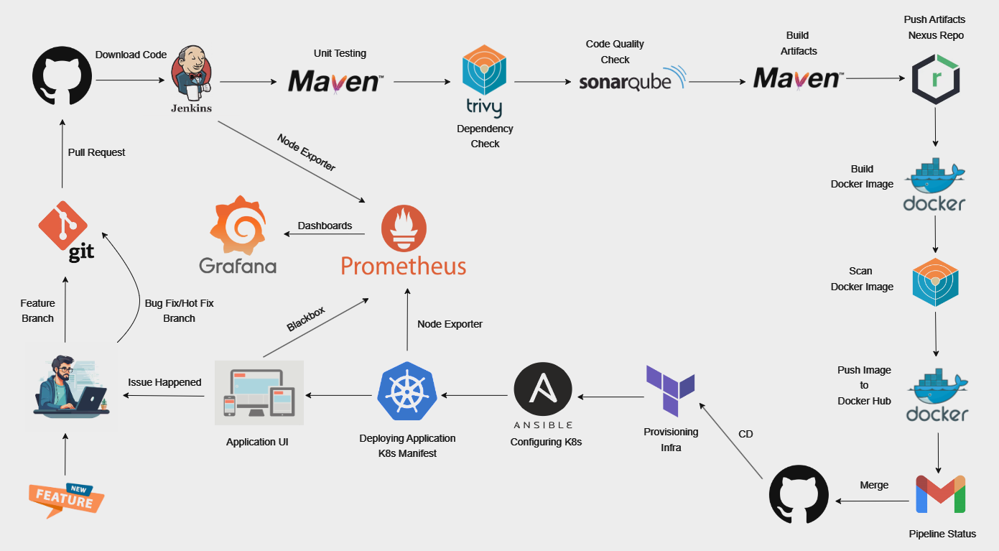

# 🚀 Automated End-to-End CI/CD Pipeline for Java Application on AWS

Welcome to the **Automated CI/CD Pipeline for Java Application on AWS** repository! This project demonstrates an advanced DevOps pipeline that incorporates continuous integration (CI) and continuous deployment (CD) practices, utilizing an array of DevOps tools to ensure efficient, secure, and scalable delivery of a Java-based application.

## 🏗️ Project Architecture

This architecture consists of an end-to-end pipeline designed to manage the deployment of a Java-based application on AWS. It integrates a range of DevOps tools to streamline code delivery, ensuring efficient and automated deployment from development to production.

### Architectural Highlights:

- **Infrastructure Provisioning**: Using **Terraform**, the project provisions a scalable and secure environment on AWS, including VPC setup, subnets, gateways, route tables, and EC2 instances required for the Kubernetes cluster.
- **Kubernetes Orchestration**: Managed by **Ansible**, Kubernetes on AWS EC2 instances enables efficient scaling and container orchestration for the application.
- **Real-Time Monitoring**: Implemented with **Prometheus** and **Grafana** for continuous system health monitoring, providing insights and alerts based on defined performance metrics.

### CI/CD Workflow:

1. **Feature Development**: When the client requests a new feature, the developer creates a **feature branch**. The code is developed and tested locally, and once ready, a pull request is raised.
2. **CI Pipeline Trigger**: The pull request triggers the CI pipeline in Jenkins, initiating stages for code compilation, testing, vulnerability scanning, and code quality checks.

   - If all stages pass, the changes are considered ready for production.

3. **Merge to Release Branch**: Verified changes are merged into the **release branch**, triggering the CD pipeline.

4. **CD Pipeline and Deployment**: The CD pipeline provisions the infrastructure, configures Kubernetes, deploys the application, and sets up monitoring.

   - If a bug or critical issue arises post-deployment, the developer creates a **bugfix** or **hotfix** branch, addresses the issue, and repeats the CI/CD cycle.

5. **Versioning**: This cycle repeats for each new feature, bug fix, or version, ensuring the application remains up-to-date and aligned with client requirements.

### Architecture

 <!-- Replace with your actual diagram path -->

---

> The architecture is depicted in the provided diagram, visually illustrating this workflow.

## 📋 Project Overview

In this project, we developed a fully automated CI/CD pipeline using Jenkins, SonarQube, Nexus, Docker, Terraform, Ansible, Kubernetes, Prometheus, and Grafana for real-time monitoring. This setup accelerates the delivery lifecycle, ensuring that code changes are integrated, tested, and deployed seamlessly across environments. The project is built to ensure continuous feedback and a high-quality code base, supported by monitoring and alerting for complete visibility into application health.

## ⚙️ DevOps Tools and Infrastructure

The CI/CD pipeline and infrastructure were built on AWS and include the following:

- **Jenkins** for orchestrating CI/CD workflows.
- **SonarQube** for code quality checks and static code analysis.
- **Nexus Repository** for artifact storage and version control.
- **Docker** for containerizing applications and dependencies.
- **Terraform** for provisioning AWS infrastructure, including VPCs and EC2 instances.
- **Ansible** for configuring Kubernetes clusters and managing deployment.
- **Kubernetes** for container orchestration and scalability.
- **Prometheus** and **Grafana** for monitoring, alerting, and visualizing application metrics.

## 🛠️ CI Pipeline Workflow (Jenkins)

The CI pipeline is orchestrated by Jenkins and follows a multi-stage process to ensure quality and readiness of the Java application code. This setup enforces automated testing, quality analysis, and artifact management, all integrated into a seamless workflow.

### Step-by-Step CI Stages:

1. **Environment Setup**:

   - Three dedicated instances are created to host Jenkins, SonarQube, and Nexus servers. The following Docker images are used for each setup:
     - Jenkins: `jenkins/jenkins:lts-jdk17`
     - SonarQube: `sonarqube:lts-community`
     - Nexus: `sonatype/nexus3`

2. **Jenkins Configuration**:

   - Essential plugins are installed, including **JDK**, **SonarQube Scanner**, **Sonar Quality Gate**, **Docker**, **Maven**, **Email Extension**, among others.
   - Jenkins is configured with SonarQube and Nexus integrations. This includes generating necessary credentials, setting up webhooks, and configuring Nexus repository access.
   - Webhooks are configured to trigger pipeline runs for new code changes.

3. **Pipeline Script**:
   - The CI pipeline is defined in a declarative Groovy `Jenkinsfile`, comprising the following stages:
   - **Checkout SCM**: The pipeline begins by fetching the latest code from the Git repository.
   - **Code Compilation**: The application is compiled using Maven to ensure there are no syntax errors or compilation issues.
   - **Testing**: Unit tests are executed with Maven to validate code functionality and reliability.
   - **Dependency Vulnerability Check**: A security scan is run using **Trivy** to detect any vulnerabilities within dependencies.
   - **Code Quality Analysis**: SonarQube performs static code analysis and enforces a **Sonar Quality Gate** pass to ensure code quality standards.
   - **Artifact Build**: Maven packages the application and the build artifacts are stored in Nexus for centralized management and version control.
   - **Docker Image Build & Scan**: A Docker image is built from the Dockerfile present in the repository, and **Trivy** is used to scan the image for security vulnerabilities.
   - **Push to Docker Hub**: The final Docker image is pushed to Docker Hub, making it accessible for containerized deployments.
   - **Notifications**: Upon pipeline completion, Jenkins sends an email notification with a summary of the pipeline status and Trivy reports, keeping stakeholders informed.

This CI pipeline ensures that code meets quality and security standards before moving to the deployment stage, thus supporting a robust and reliable delivery process.

## 🚀 CD Pipeline Workflow (Jenkins)

Once the CI pipeline has successfully validated and packaged the application, the CD pipeline is triggered when code changes are merged into the release branch. This CD workflow focuses on automating infrastructure provisioning, application deployment, and monitoring setup to ensure smooth and scalable production-ready deployments.

### Step-by-Step CD Stages:

1. **Infrastructure Setup with Terraform**:

   - Terraform scripts are used to provision AWS resources, creating a Virtual Private Cloud (VPC) with necessary subnets, route tables, gateways, and EC2 instances configured for a Kubernetes cluster.
   - Instances are created with specific security rules for secure communication within the cluster.

2. **Kubernetes Cluster Setup with Ansible**:

   - Ansible playbooks are used to configure Kubernetes on the provisioned EC2 instances, ensuring a production-grade cluster is set up.
   - The playbooks automate cluster configuration tasks, making the environment scalable and easily manageable.

3. **Application Deployment**:

   - Using Kubernetes manifests, the Java application is deployed to the Kubernetes cluster. This includes configuring the necessary deployment, service, and pod specifications to ensure proper scaling and load balancing.
   - The deployment utilizes the Docker image created and pushed in the CI pipeline, allowing for consistent and controlled application delivery.

4. **Monitoring Setup**:
   - Kubernetes manifests for **Prometheus** and **Grafana** are deployed within the cluster to enable real-time application and infrastructure monitoring.
   - Prometheus collects metrics from the application and infrastructure, while Grafana provides a user-friendly dashboard to visualize these metrics.
   - Alerts are set up within Prometheus to notify teams if any critical performance issues or resource utilization anomalies are detected.

This CD pipeline ensures that every code change passing the CI phase is automatically deployed and monitored in a controlled AWS environment, minimizing manual intervention and optimizing deployment reliability.

## 📈 Monitoring & Alerts

With **Prometheus** and **Grafana** set up, the system provides comprehensive monitoring and alerting capabilities. Key metrics such as CPU usage, memory consumption, and application performance indicators are continuously tracked. Alerts are configured to notify relevant teams if performance issues arise, ensuring prompt action and minimal downtime.

## 🎉 Key Benefits

- **Automated Deployments**: Ensures reliable, consistent, and rapid delivery of application updates.
- **Quality Assurance**: Built-in quality checks enforce code and dependency security standards, boosting confidence in every deployment.
- **Scalability**: Kubernetes provides automated container scaling based on resource demands.
- **Real-Time Monitoring**: Continuous monitoring offers proactive insight into application health, improving response times for any operational issues.

## 📝 Prerequisites

- **AWS Account** with appropriate access for provisioning resources.
- **Jenkins** (recommended version: `lts-jdk17`)
- **Docker**
- **Terraform** for IaC deployment.
- **Ansible** for configuration management.
- **Git** for version control.

<!-- ## 📜 How to Use

1. **Clone** this repository.
2. Configure **AWS credentials** and other environment variables as required.
3. Run `terraform apply` in the `terraform-scripts/` directory to set up the infrastructure.
4. Execute `ansible-playbook` to configure the Kubernetes cluster and prepare it for deployment.
5. Trigger the Jenkins pipeline to start the automated CI/CD process. -->

---

Thank you for exploring this project! For any issues, feature requests, or contributions, feel free to raise a pull request or open an issue. Let's automate efficiently! 😊
